# CI - Continuous Integration

CI "é uma prática de desenvolvimento que visa integrar o código de diversos membros de um time através de um repositório compartilhado. Cada integração é verificada através de builds e testes automatizados".

Ou seja, todas as vezes que estivermos desenvolvendo um software, precisamos garantir que ele funcione e não quebre o repositório central. Portanto um fluxo de CI bem estruturado nos dará mais segurança para entregarmos desta forma.

- Automatiza os processos e garante que o código de todos está funcionando em conjunto;
- Detecta erros antes de eles irem para produção;
- Garante que o build está sendo gerado corretamente.

## Dinâmica de processo

Temos então um repositório central, com vários desenvolvedores realizando *pull request*. Para cada *pull request*, será rodado o processo de CI que irá fazer um *clone* da aplicação, ou seja, ele terá um servidor próprio onde realiza o clone da aplicação, logo após serão baixadas as dependências (npm, pip, composer, etc.) e finalmente serão realizados os testes. E quando todo o fluxo for aprovado será realizado o *merge*.

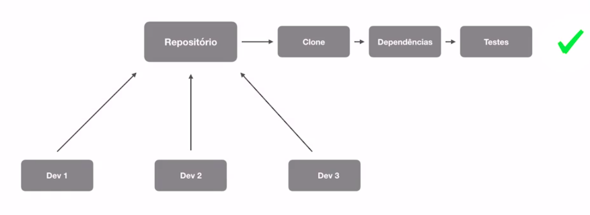

## Algumas boas práticas

- Pipeline (todas as etapadas de processo de integração da aplicação) rápido, pois quanto menos o poder computacional e mais rápido for o build, maior será a economia, pois conseguiremos fazer mais builds simultâneos. Importante destacar algumas das ferramentas de CI cobram por minuto de máquinas utilizadas;
- Ambiente isolado;
- Rodar primeiro os testes mais rápidos;
- Todos do time podem ter acesso aos resultados para que o time fique ciente de onde estão quebrando os testes.

## Ferramentas populares

- Jenkins;
- CircleCI;
- Travis;
- Google Cloud Build;
- Amazon Cloud Build;
- Azure Pipelines;
- GitLab CI;
- Codeship;
- Go CD;
- Team City.

## Iniciando com GCP - Google Cloud Platform

Na nossa parte prática, iremos utilizar o Google Cloud Build da GCP. Porém, o que for abordado aqui poderíamos aplicar em outras ferramentas, obviamente que cada ferramenta possui suas particularidades.

O GCP não é gratuíto, mas normalmente a Google libera cupons de desconto para uso.

É necessário compreender que tudo é separado por projetos no GCP. Portanto vamos criar um novo projeto para realizarmos a nossa prática.

Confira o dashboard do projeto que criamos.

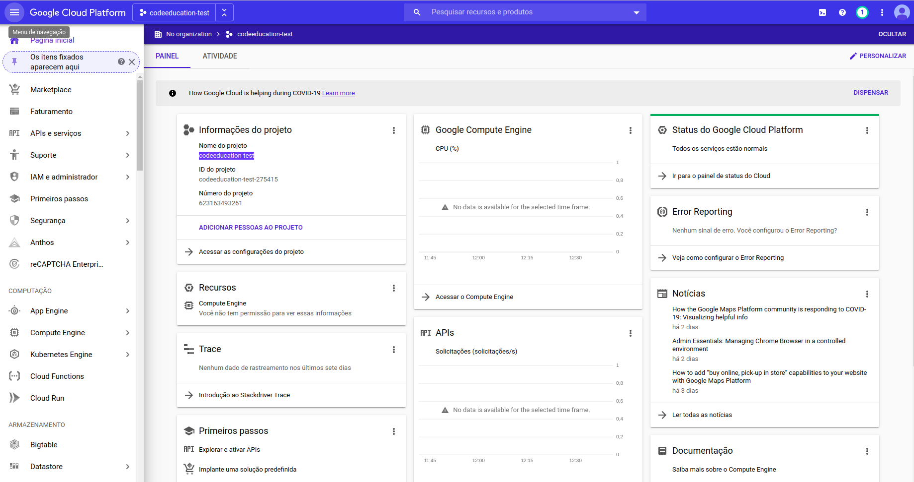

É muito indicado que façamos a instalação do CLI da GCP através [deste link](https://cloud.google.com/sdk).

Vamos então habilitar o Google Cloud Build:

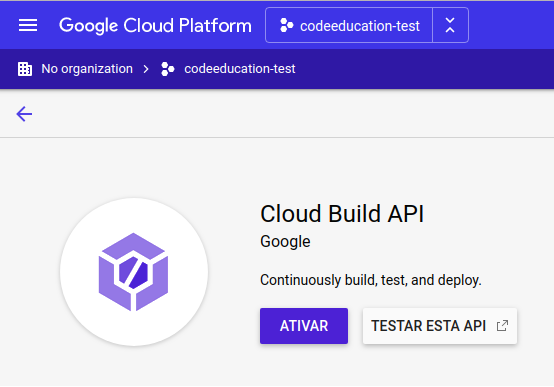

### Criando o primeiro *trigger*

Algumas questões que precisamos compreender antes de prosseguir:

- Todas as vezes que formos utilizar o Google Cloud Build - GCB -, vamos ter alguns gatilhos que serão acionados (quando der um *push* no repositório o GCB será acionado).

Vamos reaproveitar o projeto que criamos [aqui](https://github.com/rodrigotamura/microservices/tree/master/Docker/laravel) no módulo de Docker, porém com um Docker compose indicado para o GCB, que seria [esse daqui](../Docker/laravel/docker-compose.cloudbuild.yaml).

As principais modificações seriam remover as variáveis de ambiente pois vamos entender que o arquivo .env entrará em funcionamento, e alterar o *entrypoint*, pois não iremos mais utilizar o Dockerize.

Agora, dentro da pasta `.docker` do projeto, vamos criar um novo arquivo de configuração chamado [cloudbuild.yaml](../Docker/laravel/cloudbuild.yaml). Este arquivo será lido pelo GCB onde terão todos os passos que devem ser executados.

Quando trabalhamos com GCB teremos duas opções:

1. Configurar para que o GCB leia e execute o Dockerfile da aplicação realizando também o teste de tudo o que está no Dockerfile ou;
2. Que o GCB leia o cloudbuild.yaml que criamos anteriormente, conseguindo fazer testes mais profundos com a pipeline passo-a-passo de tudo o que desejamos testar (**o indicado seria o uso desta opção**).

Abra o [cloudbuild.yaml](../Docker/laravel/cloudbuild.yaml) e veja cada comando com suas respectivas explicações. Logo após vamos enviar estes arquivos criados para o nosso repositório central.

Acesse o Google Cloud Build, vamos configurar o repositório e criar uma nova **_trigger_** que é um acionador que será executado toda vez que algo acontecer.

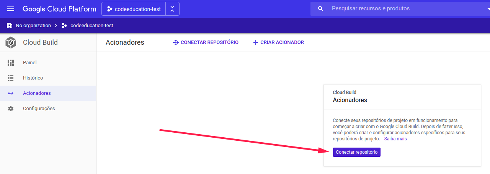

Caso esteja utilizando o GitHub, o mesmo solicitará a autenticação e a escolha do repositório a ser configurado o GCB. Após isso, vamos criar um acionador, ou *trigger*:

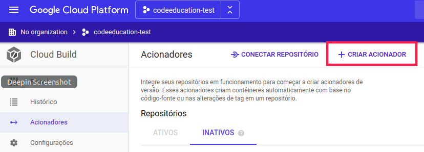

- Nome: informar um nome para o trigger;
- Evento: vamos selecionar que o gatilho seja acionado quando houver novos *pushes* para o repositório;
- Fonte - Repositório: Selecionar qual repositório;
- Fonte - Ramificação: Qual o branch que será configurado o acionador;
- Configuração da compilação: indica qual o arquivo de compilação será utilizado. Neste caso iremos utilizar a opção "Arquivo de configuração do Cloud Build (yaml ou json)", que irá buscar o arquivo `cloudbuild.yaml` de criamos anteriormente.

Após tudo configurado, vamos executar esta trigger manualmente:

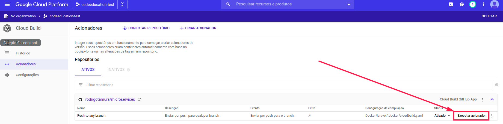

Você notará nos logs que haverão erros de que não está encontrando a imagem do docker-compose no local que indicamos:

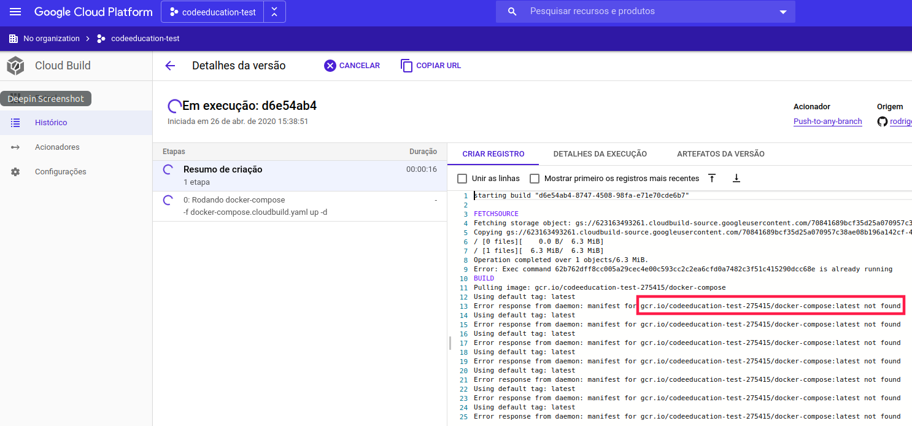

O Docker compose precisa ser instalado para que consigamos trabalhar com ele. No próximo tópico iremos realizar esta instalação.

### Entendendo a instalação do Docker

Vimos que houve um erro no tópico anterior quando tentarmos criar o primeiro passo da pipeline no GCB. Aconteceu que ao instalar o Docker compose através do endereço do Google Cloud Registry que informamos no [cloudbuild.yaml](../Docker/laravel/cloudbuild.yaml) não foi encontrado nada.

Agora vamos aprender a como criar uma nova imagem do Docker Compose e colocar lá dentro do Container Registry, dentro do Google Cloud.

Toda vez que estamos trabalhando com o Docker Hub, todas as nossas imagens ficam gravadas lá. NEste nosso caso, tudo o que agente for gravar, ficará gravado no Container Registry do GCP, que é **totalmente privado e somente usuários que autorizamos terão acesso**.

A partir deste momento nós precisaremos realizar o *build* da imagem do Docker Compose para colocá-lo dentro do Container Registry.

Portanto, temos que entender dois pontos importantes.

1. Dentro do Container Registry do GCP há um container aberto para todo mundo.E lá dentro tem, por exemplo, o Docker, Git, Go, Dockerize, etc. Então toda vez que quisermos utilizar o Google Cloud Build podemos chamar o endereço **_gcr.io/cloud-builders/Docker_** para, por exemplo, executar o Docker; ou **_gcr.io/cloud-builders/git_** para executar o Git.

2. Porém existirão imagens que não estarão disponíveis, como o Docker Compose, no nosso caso.

Para isso temos que colocar o Docker Compose dentro do nosso Container Registry (**_gcr.io/$PROJECT_ID_** (codeeducation-test)) que não é público.

A ideia é nós termos um Dockerfile, e dentro dele instalarmos o Docker Compose e chamar o *entrypoint* para o Docker Compose. Assim, todas as vezes que a imagem for chamada ela já vai executar o Docker Compose.

Logo após, vamos criar o cloudbuild.yaml e nós vamos **utilizar o Docker do gcr.io/cloud-builders/**, e depois **gerar um _build_ a partir do Dockerfile** e esse Dockerfile irá realizar o *build* do Docker Compose.

Uma vez que tenho o Docker Compose, vamos dar o push da imagem no **_gcr.io/$PROJECT_ID_** (codeeducation-test).

Visão geral da instalação do Dokcer Compose:

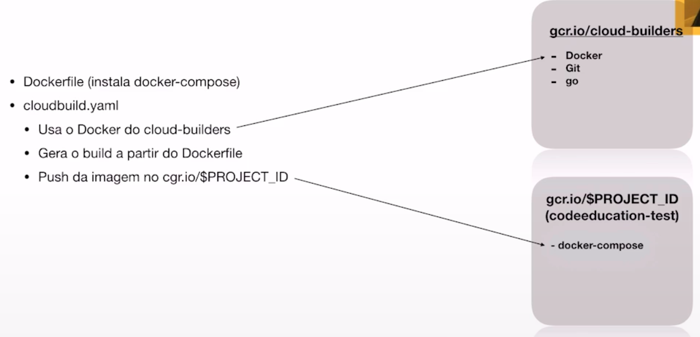

O interessante é que isso será feito somente uma vez, podendo ser usado outras vezes.

### Instalando o Docker Compose no Registry

Lá no GCP, acesse o menu para o **Container Registry**. E você poderá ver as suas imagens disponíveis, inclusive as imagens públicas que comentamos anteriormente.

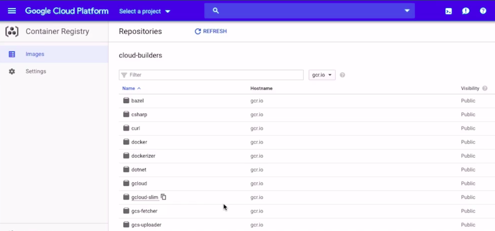

Para não perdermos tempo já existe alguém que já inclui uma imagem de Docker Compose lá dentro do Container Registry: [acesse aqui o repositório](https://github.com/GoogleCloudPlatform/cloud-builders-community/tree/master/docker-compose).

Vamos criar um diretório chamado `docker-compose`, e dentro deste diretório vamos copiar o [Dockerfile](./CI/docker-compose/Dockerfile) e o [cloudbuild.yaml](./CI/docker-compose/cloudbuild.yaml) do repositório comentado anteriormente.

Agora, dentro do diretório vamos inicializar um repositório GIT, e também vamos criar um novo repositório no GitHub ([esse daqui](https://github.com/rodrigotamura/cloud-build-docker-compose)).

Agora vamos retornar ao dash do Cloud Build (GCP) e vamos adicionar um novo trigger deste repositório que acabamos de criar, indicando o [cloudbuild.yaml](./CI/docker-compose/cloudbuild.yaml) para realizar o build. Execute o acionador criado e você verá que a imagem com o Docker Compose será criado.

Você perceberá que no Container Registry do GCP aparecerá a imagem do `docker-compose`:

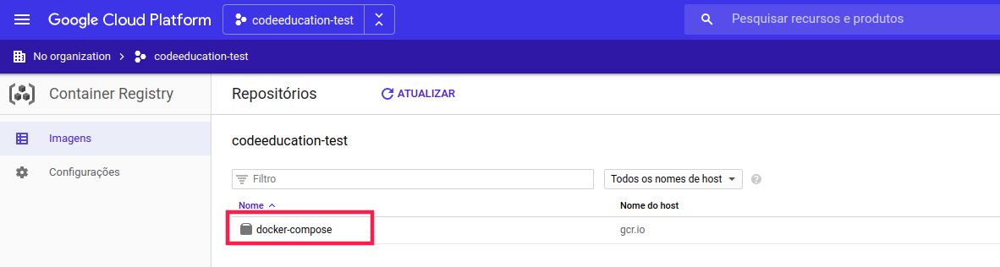

**Finalmente** vamos executar o *trigger* que criamos [neste tópico](container-registry-docker-compose.png) e que acabou dando erro pelo fato de não existir a imagem do Docker Compose. Você verá que deu tudo certo desta vez:

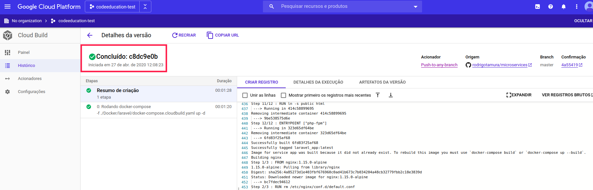

### Executando pipeline completo

#### Pipeline - Verificando se container está no ar

Nesta etapa do pipeline vamos verficiar se os containers estão foram para o ar corretamente. Para este teste iremos executar o comando `docker ps`.

Vamos abrir o arquivo [cloudbuild.yaml](../Docker/laravel/cloudbuild.yaml) e adicionar este passo, cujo id é `Listando containers - docker ps` (abra o arquivo para ver as explicações mais detalhadas).

Ao realizar o *push* deste arquivo editado ao repositório, você irá notar que o GCB irá rodar a *trigger*, pois está programado para que, cada vez que alteramos algo no repositório este *trigger* será acionado.

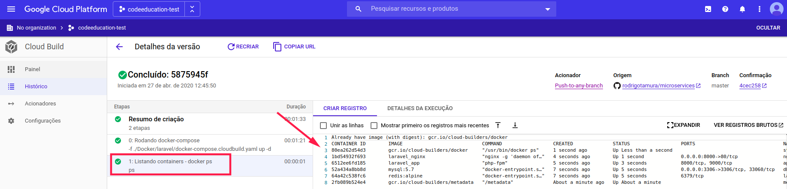

#### Pipeline - Rodando o Composer

Vamos abrir o arquivo [cloudbuild.yaml](../Docker/laravel/cloudbuild.yaml) e adicionar este passo, cujo id é `Rodando o Composer` (abra o arquivo para ver as explicações mais detalhadas).

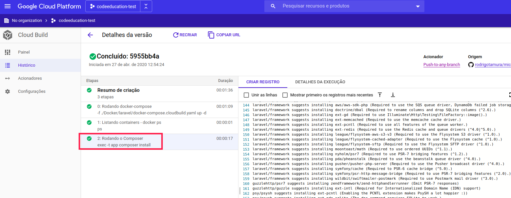

#### Pipeline - Copiando o .ENV

Vamos abrir o arquivo [cloudbuild.yaml](../Docker/laravel/cloudbuild.yaml) e adicionar este passo, cujo id é `Copiando .ENV` (abra o arquivo para ver as explicações mais detalhadas).

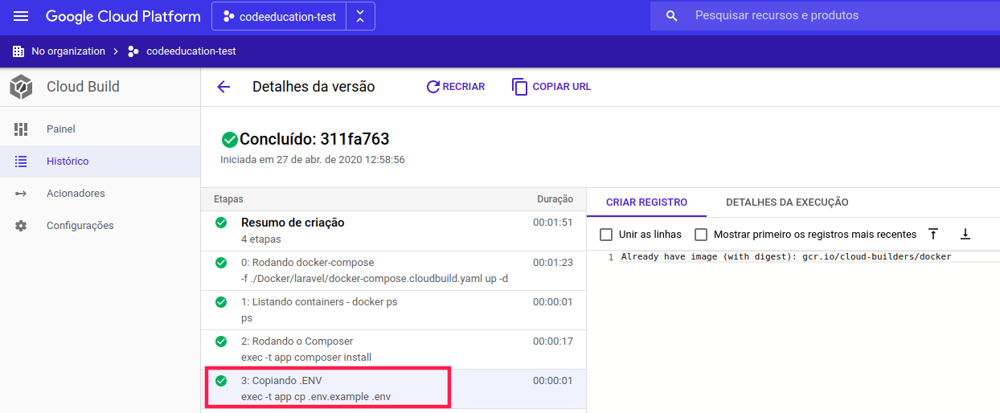

#### Pipeline - Executando o key:generate

Para que o projeto Laravel funcione, precisamos executar o `key:generate`.

Vamos abrir o arquivo [cloudbuild.yaml](../Docker/laravel/cloudbuild.yaml) e adicionar este passo, cujo id é `Executando o key:generate` (abra o arquivo para ver as explicações mais detalhadas).

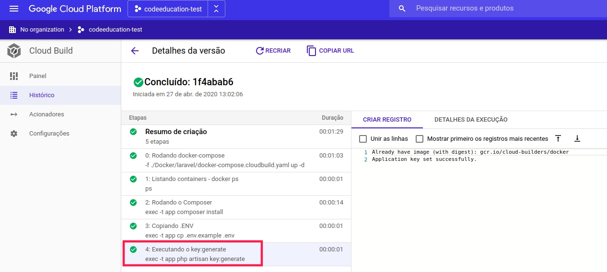

#### Pipeline - Migrations

Vamos rodar as *migrations* do projeto no banco de dados. Esta é uma ótima oportunidade para verificar se o serviço de banco de dados está funcionando corretamente.

Vamos abrir o arquivo [cloudbuild.yaml](../Docker/laravel/cloudbuild.yaml) e adicionar este passo, cujo id é `Rodando migrations` (abra o arquivo para ver as explicações mais detalhadas).

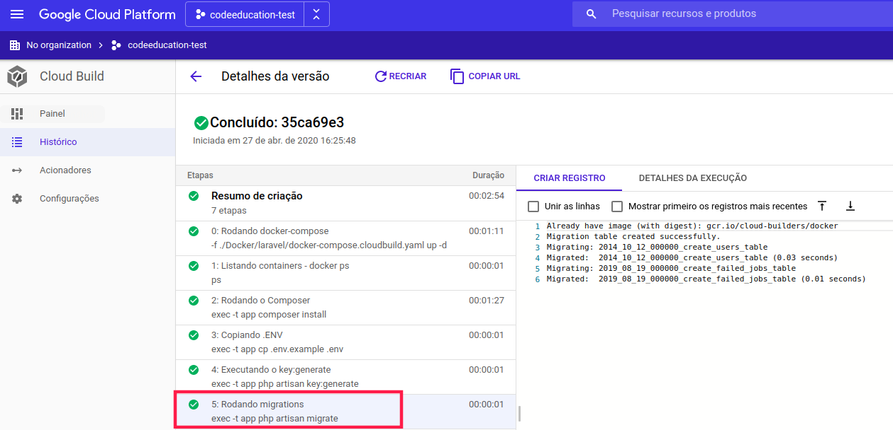

#### Pipeline - Rodando PHPUnit

Chegou a parte de rodar os testes da aplicação.

Vamos abrir o arquivo [cloudbuild.yaml](../Docker/laravel/cloudbuild.yaml) e adicionar este passo, cujo id é `Rodando testes` (abra o arquivo para ver as explicações mais detalhadas).

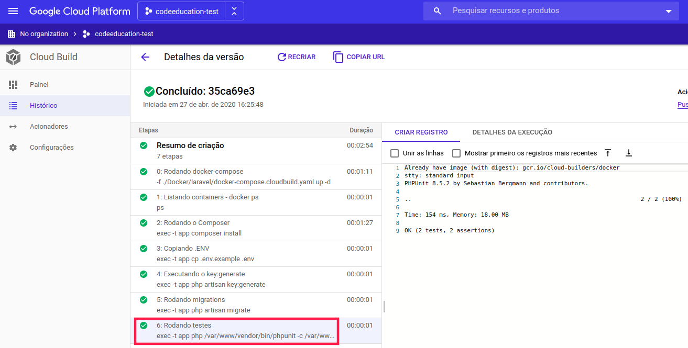

### Instalando Cloud Build App no GitHub

Vamos fazer uma implementação a dmais no GitHub, onde toda vez que criarmos uma *pull request* o GitHub automaticamente acione no Google Cloud Build e roda para garantir que está tudo bem para somente depois realizar o *merge*.

Isso é possível através de uma aplicação do GitHub feita pela Google Cloud Build no marketplace, onde podemos instalar dentro de uma conta.

Primeiramente vamos acessar o [marketplace do GitHub](https://github.com/marketplace) e pesquise pelo **Google Cloud Build**, como mostra o print abaixo:

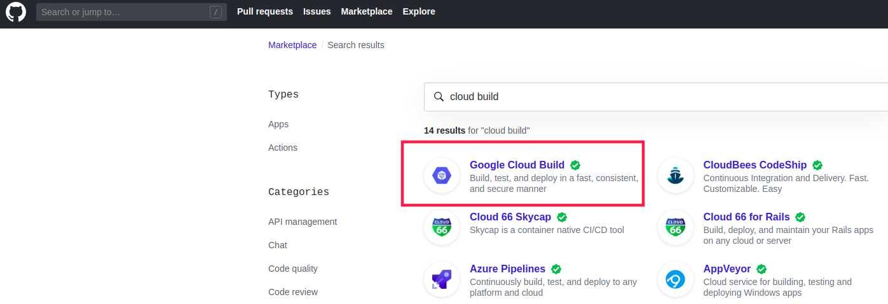

Se necessário, passe por todos os processos de permissão de uso da conta e siga os passos requeridos para realizar esta integração. A seguinte tela aparecerá indicando que a integração ocorreu com sucesso:

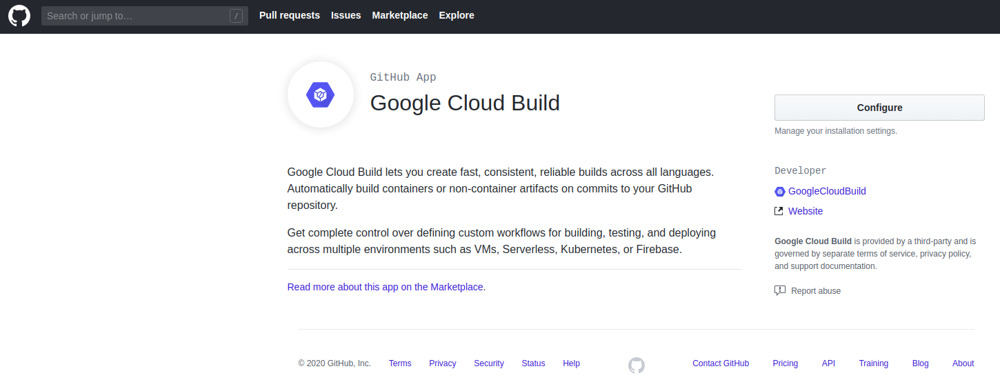

Se ainda não tem, vamos criar uma `branch develop` do projeto. Logo vamos alterar algum arquivo para realizarmos o *push* ao repositório e acionar a *trigger* que configuramos anteriormente.

Após realizar o *push*, e solicitar a realização do *pull request* lá no GitHub do `develop` para o `master`, você notará que agora o GitHub consegue visualizar se o processo de *build* lá no GCB finalizou ou não:

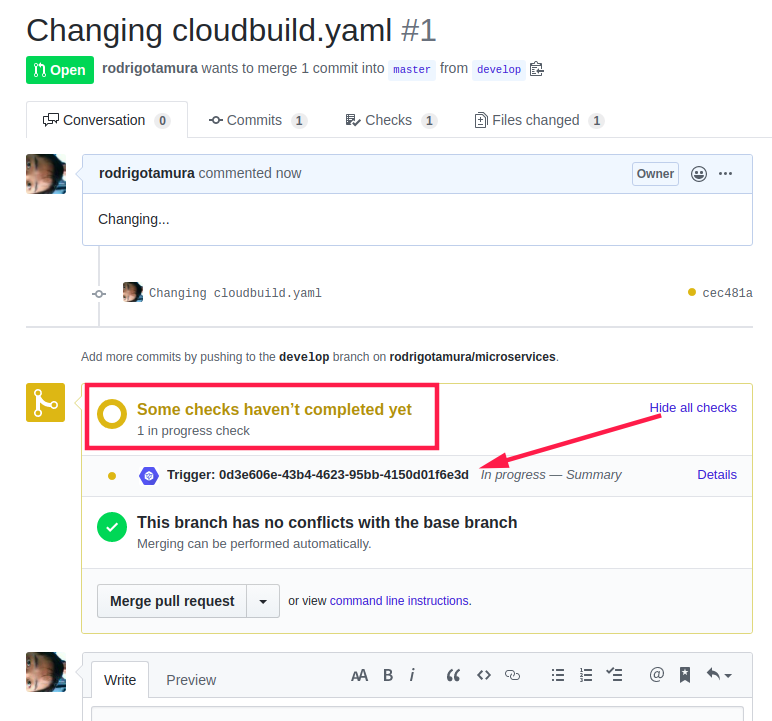

Note que o botão de *merge* ainda não funciona se o processo não concluir com sucesso.

Se tudo ocorrer bem lá no GCB, será sinalizado no GitHub:

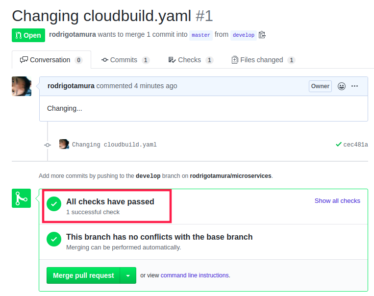