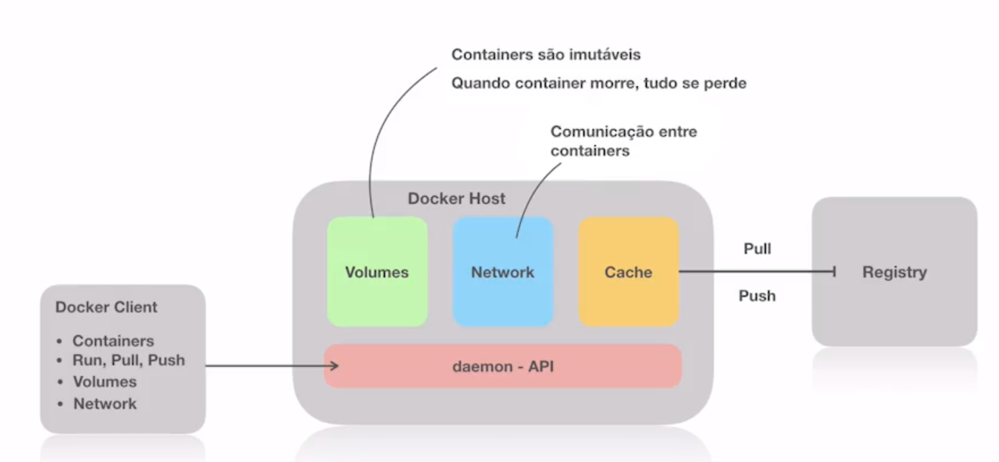
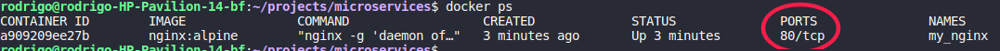
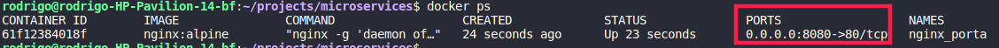

# Docker

## Modulo 1:

### a. Conceitos Basicos

container é apenas uma máquina virtual mais leve? Na verdade, o conceito vai mais além disso:

#### a.1 Namespaces

Namespace é a forma para isolar processos. Um processo "pai" que possuir um determinado namespace terão "filhos" que estão no mesmo namespace. Ou seja, torna-se um conjunto de processos com um namespace único.

 ```
SISTEMA OPERACIONAL
    Processo pai Container 1
        Processo filho container 1
        Processo filho container 1
        Processo filho container 1

    Processo pai Container 2
        Processo filho container 2
        Processo filho container 2
        Processo filho container 2
 ```

Quando falamos de CONTAINER, estamos falando de processos - e seus processos filhos - em namespaces que isolam estes processos emulando um sistema operacional.

Estes processos podem ser dos mais variados tipos:
 - PID - Um processo possui um número
 - User - Processos podem ser separados por usuários
 - Network - Ou separados por redes
 - Files system

#### a.2 Cgroups

Criado e mantido pela Google, este conceito ajudou muito a trabalhar com containers.

Cgroups controlam os recursos computacionais do container.

Repetimos que, quando falamos de container, estamos falando de isolamento de processos, ou seja, um container faz parte de um processo isolado. Então o Cgroup irá delimitar os recursos destes processos, ou seja, determinar que um determinado processo venha a consumir um tanto de memória, de cpu, o que acaba **não interferindo outros processos**.

#### a.3 File System

Quando trabalhamos com o Docker, existe um recurso chamado OFS - Overlay File System. A grande sacada do OFS é o trabalho com layers - camadas - que trabalham de forma individualizada, ou seja, ele pega a diferença do que foi alterado e na próxima versão só é guardada a diferença. Então, graças ao OFS não é necessário cópias inteiras do sistema operacional para rodar os containers (como normalmente se faz quando se trabalha com virtualização), pois eles aproveitam os recursos (dependências de kernel, filegroup, bibliotecas, etc.) já existentes do sistema operacional da máquina hospedeira.

Por este motivo que os containers são tão leves.

#### a.4 Imagens

Uma imagem é um conjunto de dependências encadeadas numa árvore pronta para ser utilizada.

Então, como os containers são baseados em OFS - trabalho em camadas e reaproveitamento de dependências existentes - quando eu baixo uma IMAGEM de uma aplicação, e uma camada de dependência desta aplicação é o `Bash`, quando eu desejar ter outra imagem de uma outra aplicação que também possui o `Bash` como dependente, logo a camada do `Bash` não precisará ser baixada, pois será reaproveitada da primeira imagem.

Normalmente, uma imagem possui um nome e uma versão (não obrigatório).

Existe um arquivo responsável que define uma imagem, ou seja, um arquivo declarativo onde escrevemos como será a imagem que iremos construir. Lembrando que uma imagem inicial é algo em branco - scratch -, como um HD formatado. Porém precisamos temos que partir de uma imagem já existente. E esta imagem existente possui suas dependências. Este arquivo é o **DOCKERFILE**.

Na composição do arquivo Dockerfile, existe uma linha de comando inicial que seria o `FROM: ImageName`. Dependendo do que for definido nesta linha, será dado o comando de baixar esta imagem com todas as depedências.

Porém podemos **customiza** esta imagem, ou seja, podemos "injetar" comandos após, por exemplo, a instalação desta imagem. Vamos supor que instalamos uma imagem do Ubuntu e, logo após, querermos instalar o Apache. Então o Dockerfile disponibiliza uma linha com o comando `RUN: <comando>` para executar qualquer coisa, no nosso caso, um `RUN: apt-get install apache2`.

Podemos também expor portas específicas nesta imagem para termos acesso a este container via linha `EXPOSE: <numero-porta>`.

Portanto, o arquivo Dockerfile é utilizado para **construir a imagem**. Caso não haja necessidade de fazer alterações em uma determinada imagem, não haverá necessidade de se ter o Dockerfile.


Agora vamos olhar mais de perto este processo (um dos "P"s). Ao abrí-lo, vamos então visualizar a imagem, e ela possui um ESTADO IMUTÁVEL.

Um container é leve e é muito rápido ao rodar se dá pelo fato de este rodar dentro de um PROCESSO! E esta imagem não é alterada de forma alguma.

Quem já trabalhou com Docker, pode-se perguntar: 

> "Se uma imagem conserva seu estado como imutável, como então eu consegui criar arquivos ali dentro?"

 Quando subimos um container, é criado junto a ele uma camada chamada **CAMADA READ/WRITE**. Note que não estamos fazendo alterações na imagem, mas apenas aplicando alterações através desta camada sem alterar a imagem.


Então quando "matarmos" este processo **serão apagadas também todas as alterações que fizemos através desta camada READ/WRITE**.

Então, no final das contas, um Dockerfile quando é feito a *build* gera-se uma nova fimagem em um processo da máquina local:


Quando geramos uma image, e realizamos nela alterações através da camada de READ/WRITE, o Docker dá a possibilidade de, a partir desta imagem "alterada" criar uma outra imagem com uma versão diferenciada (*commit*).


Portanto, **temos 2 formas de criar imagens**:

- Pegar o Dockerfile e gerar a imagem;
- Pegar um container que está rodando, escrever dentro dele através da camada Read/Write, e quando executar um *commit* uma nova imagem é gerada a partir da alteração do conteiner existente.

##### "Onde ficam as imagens?"

As imagens ficam dentro de um **IMAGE REGISTRY**, uma espécie de repositório do Github.

Toda vez que gero uma nova imagem através do Dockerfile, essa `FROM: ImageName` está vindo de um registry do IMAGE REGISTRY. Ou seja, estamos dando um `pull`.

Após ter dado o `build` desta nova imagem, podemos então da um `push` com as alterações realizadas nesta imagem e que automaticamente será "guardada" no IMAGE REGISTRY.


## Docker Host & Docker Client

Juntando os três principais conceitos do Docker: namespaces, cgroups e file systems, criou-se o conceito de **Docker Host** que fica rodando um processo que roda em background- que é uma daemon - disponibilizando uma API que fica trabalhando com o Docker.

Para conseguirmos "falar" com o Docker Host, precisaremos de um **Docker Client**. Toda vez que no prompt de comando digitarmos `docker <comando>` estaremos então invocando o Docker Client, que por sua vez irá "falar" com a API disponibilizada pela daemon do Docker.

> Existe a **Docker Toolbox*, que trabalha mais ou menos desta forma, criando uma máquina virtual instalando uma Docker Host nela. E quando damos o comando `docker <comando>` ele acessa esse Docker Host.

Então o Docker Client irá executar estas chamadas na API do Docker Host, e estas chamadas podem ser relacionados a criar ou rodar containers, executar run, pull, push, etc. 

No Docker Host possui uma camada de **cache**, que guarda a imagem quando executa um `pull` do Image Registry, não necessitando baiar da internet novamente a imagem. E quando geramos um build desta imagem, esta fica nesta camada onde podemos dar um `push` para o image registry.

O Docker Host também possui um **gerenciamento de volumes**, que nos dá o poder da persistência de dados, onde é realizado um compartilhamento de uma pasta que está na máquina local com uma imagem. Caso o processo deste container for "morto", estes dados que foram compartilhados não serão perdidos pois foram gravados no sistema operacional local.

Tanto o Docker Host e o Docker Host possui a feature de **Network** que garante a comunicação entre containers. Um container é um processo, e precisa de uma forma de se comunicar com outro container (exemplo: container A está rodando uma aplicação que necessita conectar num banco de dados que está no container B), e é no **network** que o Docker permite esta comunicação.



## Instalando o Docker

O docker foi feito basicamente para o Linux. Para o Windows Professional se utiliza o recurso do Hyper-V. Já para as outras versões do Windows (e.g. Home), será necessário instalar o **Docker Toolbox**, que rodará o Linux nesta máquina virtual.

## Hello World com Docker - comandos iniciais

- `docker run <image-name>` Cria um container;
- `docker ps` Lista os containers que estão rodando;
- `docker ps -a` Lista os containers criados, inclusive os que não estão rodando;
- `docker rm <container-name-or-id>` Remove o container, mas não a imagem do IMAGE REGISTRY;
- `docker images` Lista as imagens baixadas e que estão no cache do Docker Host;
- `docker rmi <image-id>` Remove definitivamente a imagem do registry.

## Gerenciamento básico de containers

Nesta abordagem vamos (1) expor uma porta do nosso computador, (2) colocar o nome nos containers e (3) rodar o container em background.

> Lembrando que quando subimos um container estamos subindo um processo que utiliza diversos namespaces para isolar todo o funcionamento.

Vamos subir uma imagem de NGINX, sob as instruções do Docker Hub (https://hub.docker.com).

Ao pesquisar a imagem NGINX e entrar nos detalhes da imagem, vamos perceber que existem várias *tags*. Sempre que formos instalar a imagem sem especificar a versão, o Docker irá baixar o `latest`. Outro ponto importante é a versão `alpine` (e.g. `nginx:alpine`), onde a NGINX foi "buildada" a partir de uma imagem com o Linux puro.

Neste exemplo vamos baixar baixar a imagem com o comando `docker run nginx:latest` (ou sem o `:latest`). Você irá perceber que, após o download da imagem o container NGINX é executado e a janela de prompt fica "congelada". Isso significa que este processo está rodando em background.

### Como faço pra subir o container e deixar em background (sem trancar a janela de prompt atual)

Para rodar em uma *daemon*, execute o comando `docker run -d nginx`.

E para para o container, execute o comando `docker stop <container-id>`.

## Nomeando o container e Expondo portas

Vamos executar o comando `docker run -d --name my_nginx nginx:alpine`, onde `-d` execute em um daemon e `--name my_nginx` nomeando o container como *my_nginx*.

Percebe-se que, ao listar o container que está rodando, haverá ali a porta correspondente que está disponível para aceso:



Se tentarmos acessar via url `http://localhost:80` perceberemos que não iremos conseguir acessar. Acontece que de fato o container está expondo a porta 80, porém temos que **mapear** esta porta 80 através de uma porta de nossa máquina.

Para isso, temos que passar um novo parâmetro no ato da criação do container:

`docker run -d --name nginx_porta -p 8080:80 nginx:alpine`

Através do parâmetro `-p` passado estamos determinando que ao acessar a porta do Docker Host 8080 (pode ser qualquer outra porta) está acessará a porta 80 do container criado. Veja agora como ficou o container via `docker ps`:



Basta acessar via navegador a url `http://localhost:8080` e veremos o NGINX rodando.

> Caso estejamos utilizando a **Docker Machine** - Docker rodando como uma máquina virtual, ou seja, o Docker Toolbox - ela disponibilizará um IP próprio, ficando o acesso `http://ocker-machine:80`.

## Executando comandos no container

Neste tópico iremos aprender a executar comandos em um container que está no ar.

Muitas vezes queremos entrar num container e executar comandos para realizar algumas modificações ali dentro. Para enviarmos um comando para ser executado dentro de um container temos o comando `docker exec <nome-container> <comando>` (e.g. `docker exec my_nginx uname -a` irá retornar as informações do sistema).

Mas, caso queiramos de fato "entrar" para dentro do container temos que executar `docker exec -it my_nginx /bin/sh` e acessaremos o container.

> Lembrando que todas as altrações que fizermos no container e o mesmo for derrubado e iniciado novamente, todas as alterações serão perdidas, pois a criação de um container se dá a partir de uma imagem, que é imutável. Poteriormente vamos ver sobre `commit`.

