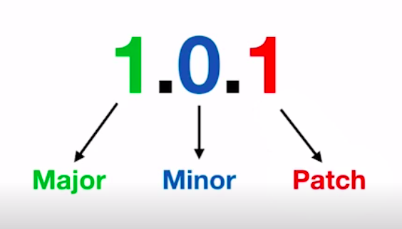

# GitFlow

O Gitflow é uma metodologia que ajuda no versionamento de software em equipes. Aqui iremos abordar a dinâmica de trabalho do Gitflow.

> O Gitflow é um processo que visa utilizar o Git como ferramenta para gerenciar a criação de novas *features*, correções, *bugs* e *releases*.

Vamos a um exemplo de FALTA de padronização de um projeto no Git:

- Nome de branches: `git checkout -b formulario_de_registro` ou `git checkout -b bug_01`;
- *Push* direto na master: `git push origin master`;

Exemplo de forma correta de se trabalhar:

- Lançando nova funcionalidade: `git checkout -b feature/registro`;
- Correção de um *bug*: `git checkout -b hotfix/registro`;
- Dar um *push* direto no *develop* (ambiente de homologação): `git push origin develop`;
- E o do *develop* dar um *merge* no *master*: `git checkout master && git merge develop`.

Portanto no Gitflow temos as seguintes premissas: **Padrão, Legibilidade e Processo**.

## Como funciona o Gitflow

Teremos duas *branches* principais:

O MASTER sempre vai ter o código-fonte que está em produção. E o DEVELOP vai ter o código-fonte em desenvolvimento incluindo novas funcionalidades.

A regra de ouro é: 👉 **NUNCA COMITAR DIRETAMENTE NO MASTER** 👈

### Branch Develop

A *branch develop* sempre estará atrelada a outras três *branches*:
- Features;
- Releases;
- Hotfixes;

Estas três *branches* sempre farão o *merge* na *branch develop*.

#### Branch Feature

Criada a partir do último *commit* da *branch develop*, aqui serão criadas as novas funcionalidades.

Logo após de desenvolver a nova funcionalidade:

#### Branch Release

Criada a partir do último *commit* da *branch develop*, aqui serão lançadas a nova versão da aplicação (de NOVAS funcionalidades, não de *bugs*).

Vamos supor que a *branch develop* já possui várias funcionalidades novas, desenvolvidas por vários colaboradores. A partir disso iremos gerar a *branch release* com a versão incrementada da atual, e que por sua vez, irá ser finalmente enviada para a *branch master*.

#### Branch Hotfix

*Branch* responsável pelas correções de *bugs* dentro da aplicação.

Como a *branch master* deve receber a correção IMEDIATAMENTE, o *merge* da *branch hotfix* deve ser dado diretamente ao *master* e ao *develop*.

### Extensão Gitflow

Existe uma opção que pode ser aplicada em um projeto para facilitar o trabalho no Git utilizando a metodologia Gitflow. Salienta-se que não é algo essencial para se trabalhar com a metodologia, sendo que é totalmente viável a aplicação do Gitflow sem o uso desta extensão.

Temos que primeiramente instalar a extensão do Git-flow na máquina. Acesse este [link](https://github.com/nvie/gitflow/wiki/Installation) e siga as instruções da instalação para o seu sistema operacional.

Somente inicialize o Git no seu projeto desta forma: `git flow init`.

Abaixo vamos exemplificar o trabalho com o Git-flow:

Para a **Feature**:
- Início da nova funcionalidade: `git flow feature start feature/register`;
- Realiza-se o *commit* normalmente: `git add . && git commit -m "Mensagem"`;
- Encerra desevnolvimento de nova funcionalidade: `git flow feature finish feature/register`.

Para a **Release**:
- Criando a *branch release*: `git flow release start 1.0.0`;
- Fechando a *branch release* e realizando *merge* na *master*: `git flow release finish '1.0.0'`. Nesta etapa o Git-flow irá solicitar uma descrição para o *merge* e logo após será criada automaticamente a *tag* para esta versão, onde será necessário informar a descrição desta *tag* de *release*.

Para o *Hotfix*:
- Criando a *branch hotfix*: `git flow hotfix start hotfix/recurso`;
- Após finalizar o desenvolvimento da correção, realizar o `git commit -am "mensagem"` para realizar o *commit*, e logo após: `git flow hotfix finish hotfix/recurso`. Esse comanda já executará o *merge* tanto no *master* como no *develop*. Será solicitada a mensagem para o *merge*, logo após será gerada uma nova *tag*, aonde devemos informar uma descrição, e finalmente será solicitada uma descrição para o *merge* na *branch develop*.
- Cabe salientar que o nome dado ao *hotfix* deve ser já a nova versão, pois ao finalizar o Git-flow para este, será gerada uma *tag* exatamente com o nome do *hotfix* que informamos, neste caso a versão correta: `git flow hotfix start 0.1.1`;
- Outra importante informação é que, caso estejamos na *branch develop* e criarmos um *hotfix* via Git-flow, o mesmo será criado **a partir da _branch master_**, e não da *branch develop*. Ou seja, **o hotfix trabalha em cima do código em PRODUÇÃO**.

## SEMVER - Semantic Versioning

Controle de versão aplicado na maioria das aplicações hoje em dia, se dá pelo seguinte formato:

- Major: Cada nova versão incrementada é INCOMPATÍVEL com a versão anterior;
- Minor: Novos recursos implementados, mas sem comprometer com a compatibilidade;
- Patch: Correções de *bugs*.

Importante notar que na *semantic versioning*:

- Não pode possuir números negativos;
- Uma vez que a versão é gerada, não é possível mais fazer modificações;
- *Major* que comece com 0.x.y é publicamente instável e compatibilidades podem ser quebradas.

Tipos de metadados em versões:

- **alpha**: em desenvolvimento, sem se preocupar com testes unitários antigos;
- **beta**: em desenvolvimento, mas os testes unitários antigos são válidos ou considerados;
- **rc1**: RC significa *release candidate*, testes de novas funcionalidades estão válidos e a equipe já está realizando testes mais profundos;
- **rc2**: mais testes devem ser criados;
- **rc3**: mais testes....

O SEMVER se encaixa da seguinte forma com o metadado: **1.0.1-alpha, 2,4,1-alpha.1***