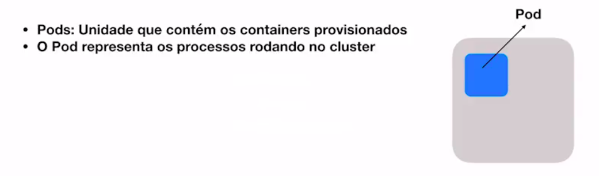
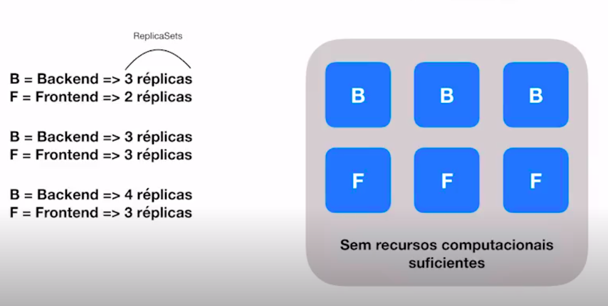
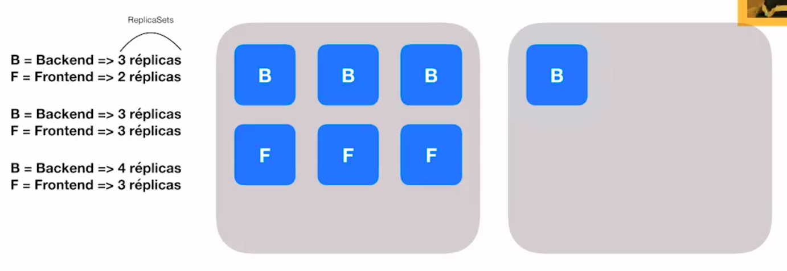
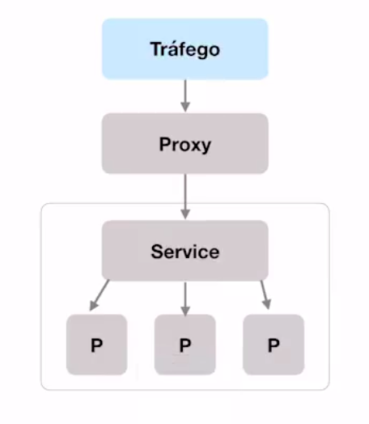
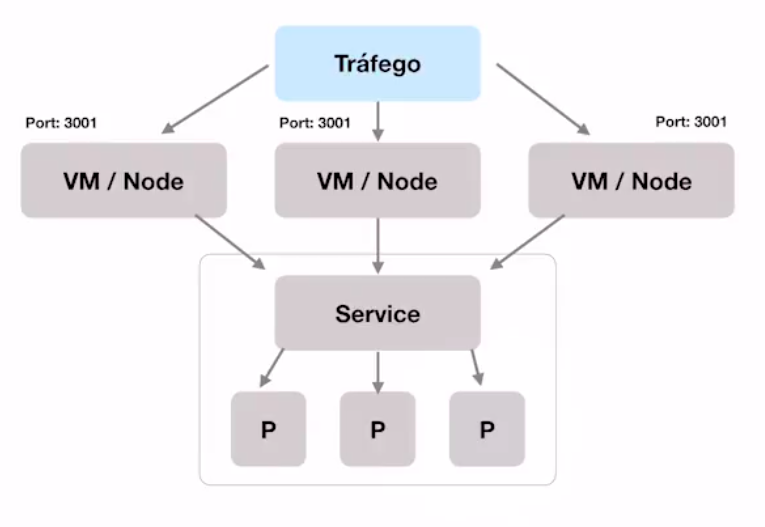
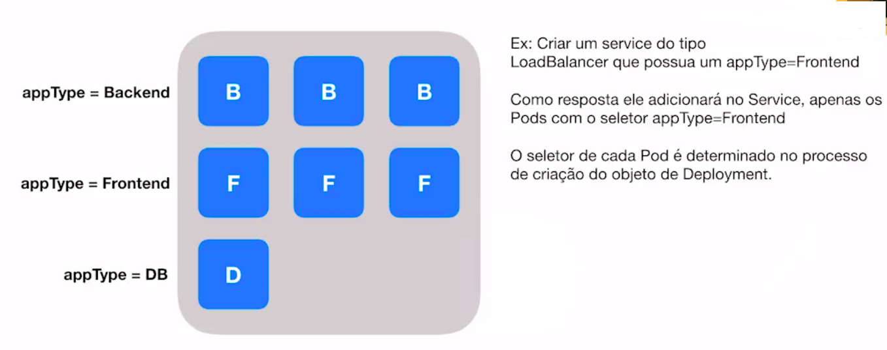

# Kubernetes

## Introdução

Kubertnetes é um orquestrador, ou gerenciador de containers riquíssimo em recursos.

> Kubernetes é um produto Open Source para automatizar a implantação, o dimensionamento e o gerenciamento de aplicativos em contêiner. (Fonte: https://kubernetes.io/pt)

### De onde veio?

O Kubernetes veio da Google, com um nome inicial de *Borg*, evoluindo para *Omega* e finalmente evoluido para Kubernetes. Portanto, não é a toa que os melhores Clods Providers para Kubernetes é a própria Google.

### Pontos importantes

- Kubernetes é disponibilizado através de um conjunto de APIs, ou seja, tudo o que fizermos no Kubernetes, no final das contas, são feitos via endpoints de API (criação de deployment, serviços, PODs, etc.);
- Porém, ao invés de ficarmos usando esta APIs podemos usar um CLI: **kubectl**;
- Tudo é baseado em estado, onde teremos vários objetos e cada objeto tem um estado, e baseado no estado deste objeto o Kubernetes toma determinadas ações;
- O Kubernetes trabalha através de **clusters**, que é um conjunto de máquinas que juntas possui um poder computacional para realizar diversos tipos de tarefas. Especificamente no caso do Kubernetes, possui um cluster chamado **_master_** que controla os processos que os outros nós irão fazer. O *master* possui alguns serviços disponíveis:
    - Kube-apiserver;
    - Kube-controller-manager;
    - Kube-scheduler;
- Outros nós que não são *master*:
    - Kubelet;
    - Kubeproxy.

### Dinâmica "Superficial"

Vamos fazer uma análise BEM SUPERFICIAL de como o Kubertnete funciona.


(o quadrado cinza representa um *cluster*)

O Kubernetes possui o conhecimento da capacidade computacional de cada *node*, o que faz com que ele consiga provisionar os recursos necessários para as tarefas.



Normalmente é um POD por container e são raras as exceções de um POD conter mais de um container rodando.

### Deployment

É um outro tipo de "objeto" de Kubernetes com o objetivo de provisionar os PODs. Para esta provisão, o Kubertnetes precisa saber quantas réplicas destes PODs serão disponibilizados. Então temos o termo **replica sets**, onde setamos quantas réplicas queremos de cada *set* de POD. Mas normalmente agente consegue setar estas réplicas sets dentro da mesma descrição do próprio *deployment*.

No esquema abaixo, temos uma aplicação *backend* (B) e *frontend* (F), onde numa primeira etapa o *deployment* provisionou dentro de um nó (quadrado cinza) 3 réplicas para o B e 2 réplicas para o F. Num segundo momento houve uma necessidade de se escalar o F para 3 réplicas. E num terceiro e último momento foi necessário escalar o B para 4 réplicas, porém não houveram mais provisionamento do *deployment* pois não existem mais recursos computacionais. Então este 4º POD vai ficar pendente até que surja mais nós ou que este nós tenha mais recursos.



Mas vamos imaginar que foi adicionado mais um nó neste *cluster* e o mesmo está vazio. Então o Kubernetes, através do *deployment* vai adicionar o POD que estava pendente.



Vamos supor que um destes nós ficou fora do ar. O Kubernetes vai provisionar os PODs que estão fora do ar no nós qu eestá funcionando, porém alguns PODs vão ficar de fora pois não caberão todos, ficando assim aguardando novos nós ou aumento dos recursos no atual nó.

## Entendendo Services

Services é a interface de comunicação entre o ambiente externo e os nossos PODs. Afinal, se tivermos vários PODs como saberei qual acessar? Então os *Services* nos ajudam nesta demanda.

> *Services* é uma forma de agregar um conjunto de PODs para então implementar políticas de visibilidade. Através das políticas de visibilidade adotada iremos expor os nossos PODs.

Existem três tipos principais de services, aos quais veremos a seguir.

### Services - ClusterIP

É o *service* padrão quando criado no Kubernetes. 



Imaginamos que temos um tráfego da rede entrando, então temos um *proxy* que sabe em qual *service* mandar, e logo temos um *service* que aponta para os PODs.

Partimos da regra que os PODs se comunicam entre si e não possui um acesso direto ao mundo externo. Então teremos um IP virtual gerada pelo *cluster* e tudo que roda ali dentro, no final das contas, acontece de forma interna.

### Services - NodePort

Diferente do ClusterIP, este tipo de *service* não trabalha com *proxy*.



Então temos uma carga externa de tráfego vindo, então nós temos os nós (node da máquina 1, node da máquina 2, etc.) e uma porta específica. Esta carga de tráfego cairá em uma determinada porta e, independente de qual porta cair, será encaminhado para um *service* que apontará para os PODs.

Então não temos um *proxy* para rotear, mas sim várias portas que são atribuídas para cada serviço. Se em algum momento cair na porta, por exemplo 3001, não importa qual node que cair este tráfego, automaticamente o Kubernetes sabe que ele tem que redirecionar para um determinado serviço.

### Service - LoadBalancer

A ideia principal é export um IP externo e a carga do tráfego cairá neste *LoadBalancer*, que fará toda a distriuição de carga, inclusive para saber em qual nó ele encaminhará o acesso.

No ClusterIP não temos acesso externo, somente para dentro do *cluster*. Se estivermos com o NodePort na mesma rede e mandarmos um tráfego para qualquer um dos nodes naquela porta, o mesmo receberá e o LoadBalancer garantirá isso do lado de fora.

### Selectors

Mas **como saberemos que determinados PODs pertence a determinado _service_?**

Para isso temos os **_Selectors_**, que será definido no *service* para fazer um filtro de verificação para saber quais PODs ele vai colocar dentro daquele serviço.



Assim temos uma ideia de como podemos selecionar os PODs dentro de um serviço através de *selectors* que definiremos as propriedades e que podem ser várias. Vamos supor que temos *backends* em NOdeJS na versão X com a propriedade Z. Podemos colocar todas estas informações no *seletor*. Quando formos criar os services conseguimos fazer esses filtros e ele vai buscar todos os PODs com estas características para gerar o *service* deixando tudo disponível.

## Minikube

Com o Minikube podemos criar uma máquina virtual com o *Singlenode Kubernetes* rodando dentro dele na nossa máquina, para que possamos fazer a prática em Kubernetes. Salienta-se que os recursos são bem limitados, não terá disponível o *LoadBalancer*, etc. Mas é totalmente viável testarmos as operações básicas.

### Instalação

Acesse [este link](https://kubernetes.io/docs/tasks/tools/install-minikube/) para iniciar a instalação do Minikube.

> 👉 Como máquina virtual estaremos utilizando o **VirtualBox**.

Lembrando que também precisamos [instalar o **kubectl**](https://kubernetes.io/docs/tasks/tools/install-kubectl/#install-kubectl-on-linux).

Para inicializar o Minikube temos que executar o comando `minikube start` (na primeira execução poderá demorar um pouco).

> O **kubectl** é um *client* do Kubernetes para se comunicar com algum *cluster* do Kubernetes. Nele podemos configurar arquivos de configuração que setam cada *namespace* para estabelecermos a comunicação com determinado *cluster*. Podemos então configurar um ambiente para que o *kubectl* se comunique com o *cluster* 1, ou o *cluster 2*, ou o *cluster* na Amazon, no GCP, no Minikube, etc. E nestes arquivos de configuração temos um certificado que garante que o kubectl tem autorização para acessar determinados *clusters* de Kubertnetes.

Após inicializado o Minikube, note que aparecerá a mensagem que *kubectl is now configured to use "minikube"*, ou seja, todos os comandos de `kubectl` que executarmos está configurado para o Minikube.

Para listarmos os *services* do nosso Minikube, vamos executar: `kubectl get svc` que retornará o seguinte:

```
NAME         TYPE        CLUSTER-IP   EXTERNAL-IP   PORT(S)   AGE
kubernetes   ClusterIP   10.96.0.1    <none>        443/TCP   9m25s
```

Retornou um elemento chamado **kubernetes**, do tipo **ClusterIP** (só possui comunicação interna por dentro do *cluster*), note que não tem IP externo, mas somente o interno.

