# Arquitetura de Software - Fundamentos

## O que é arquitetura? - Pilares

### 1. Organização de um sistema

Organização não somente o software em si, mas todo o processo que envolve o software. 

### 2. Componentização

Junção dos componentes que conseguimos fazer um sistema completo - ecossistema. Um componente pode ser reutilizado em diversos sistemas ou processos, evitando retrabalho.

### 3. Relacionamento entre sistemas

Os softwares hoje em dia reodam de forma integrada, e o arquiteto de software entende como os componentes de software se relacionarão entre si, gerando uma cadeia de fluxo de informações.

### 4. Governança

Forma de como vamos documentar todo o processo de arquitetura, forma de como definir os times, forma de como definiremos os bancos de dados, integrações, etc.

### 5. Ambiente

Tratamento de ambientes de produção, testes, desenvolvimento, etc. provendo a definição da padronização destes ambientes antes mesmo de começarmos a desenvolver.

### 6. Projeto

Algo que tem um início, meio e fim. 

### 7. Projeção

Não deve-se pensar no software como ele está neste momento, mas quais as possibilidades que este software vai poder começar a atender o futuro.

### 8. Cultura

O arquiteto de software vai estudar quais são as melhores tecnologias para serem implementadas mediante o desafio de que cada desenvolvedor envolvido vem de um canto e possui uma forma de desenvolver, conhecendo as mais diversas tecnologias.

## Frameworks

Frameworks são ferramentas e métodos que nos ajudam a focar essencialmente no objetivo final. Frameworks nos ajudam a definir um padrão de trabalho.

Quando falamos de arquitetura de software, teremos duas entidades bem importantes:

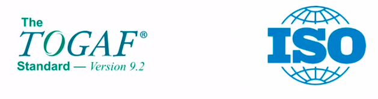

### TOGAF

É um framework conceitual, ou seja, que todo engenheiro e arquiteto de software deveriam ter pelo menos uma destas competências ou definições.

Define os processos de arquitetura. A documentação possui mais que 900 páginas. Mas é importante saber pelo menos o essencial.

A TOGAF setam conceitos e nomenclaturas padronizadas.

Visão geral de tipos de arquiteturas - TOGAF não se limita somente em arquitetura de software:

- negócio;
- sistema de informação;
- tecnologia;
- planos de migração

### ISO / IEC / IEEE 42010 - Systems and software engineering - Architecture description

Lançado em 2011, é bem mais simplificado que o TOGAF, formalizando os fundamentos da área de arquitetura de software.

## Momentos da Arquitetura de Software

### Momento: Tradicional

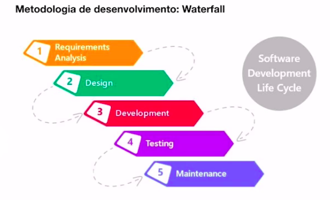

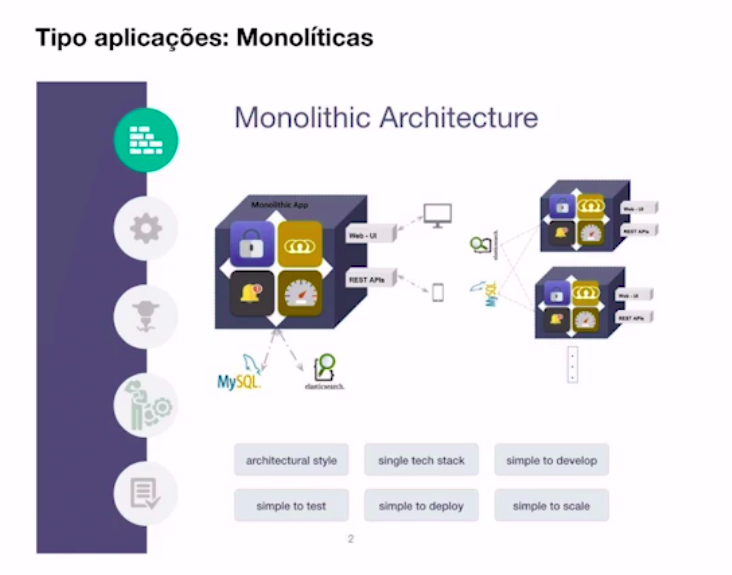

### Momento: Atual

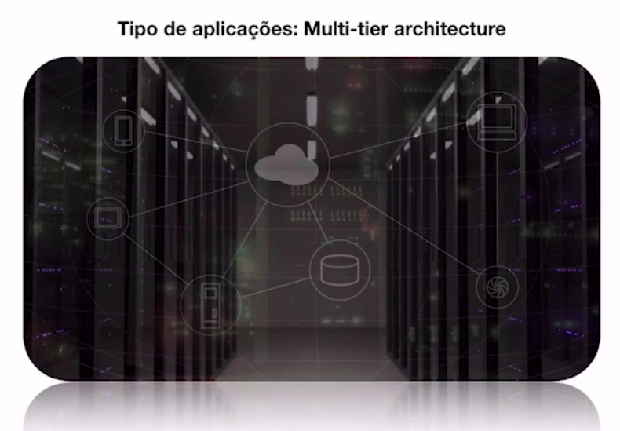

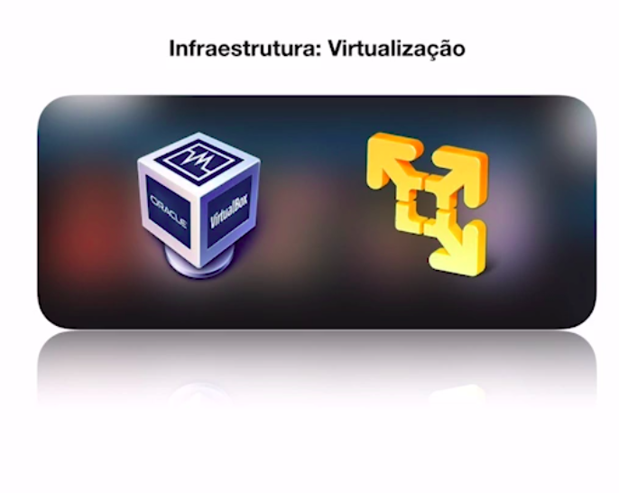

### Momento: Emergente

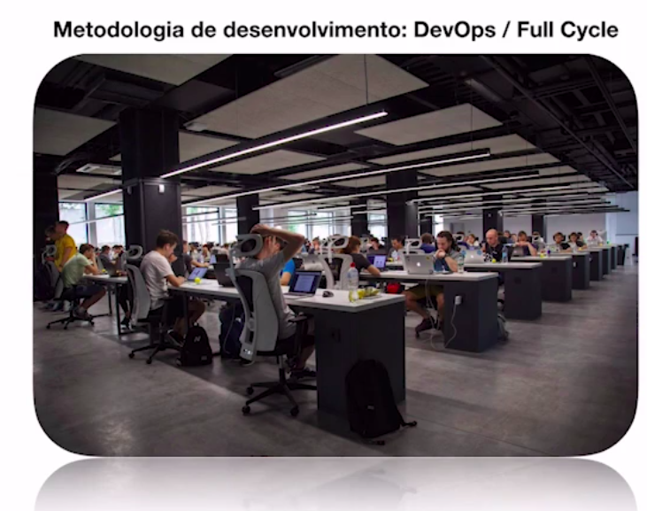

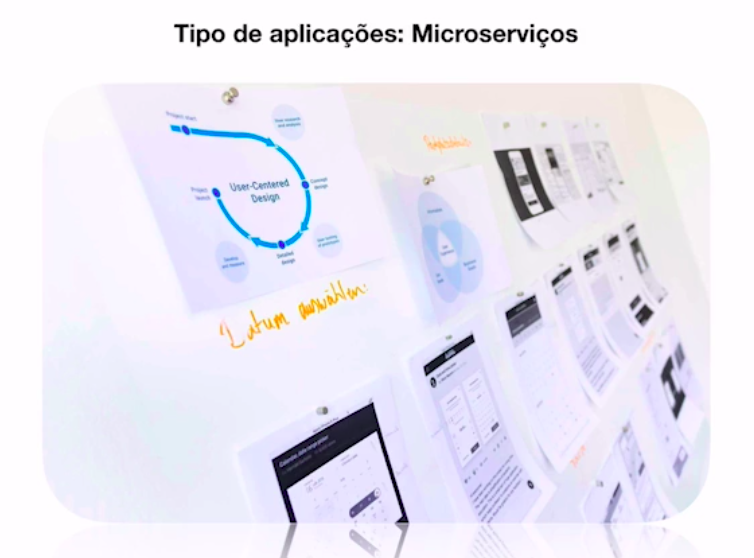

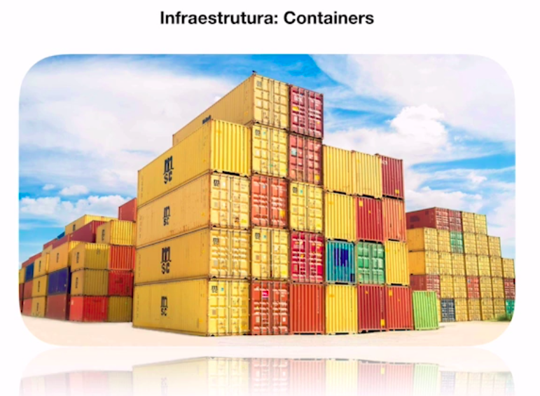

### Momento: Futuro

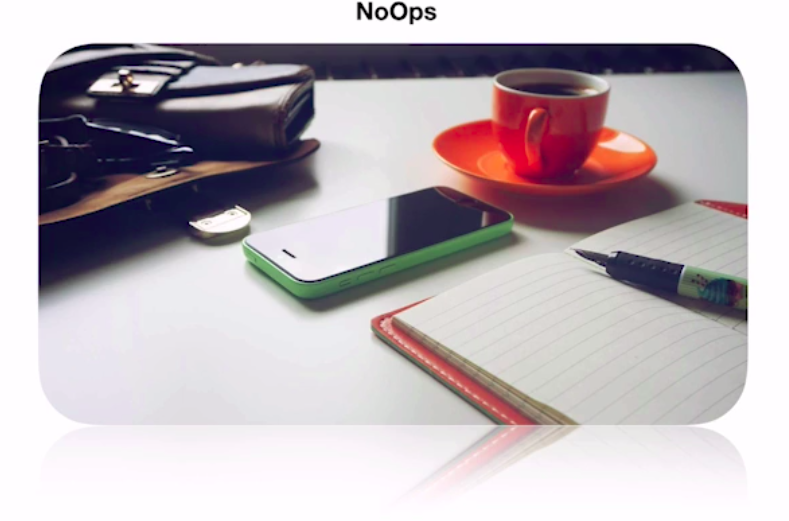

Não haverá mais necessidade em trabalhar com aqueles processos inteiros de operação para conseguirmos subir as aplicações, não ficar preocupados com servidores, memória, versões, backups. Ou seja, todo o processo de DevOps sairão das nossas mãos e ficarão sendo administradas pelas própias nuvens.

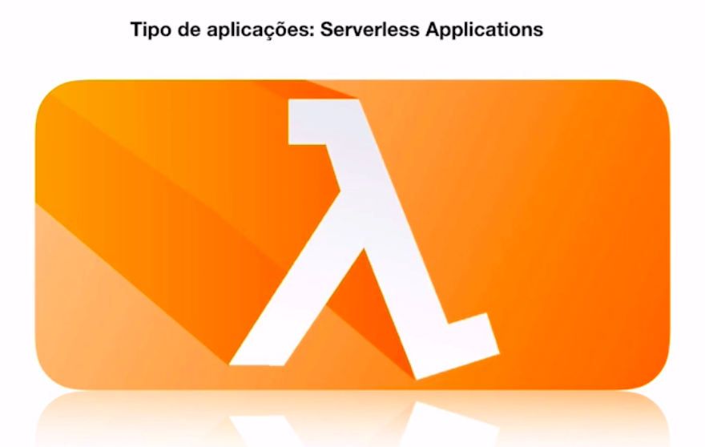

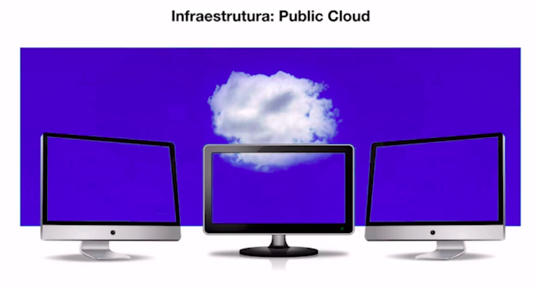

## Introdução e Escalabilidade e Sistemas Monolíticos

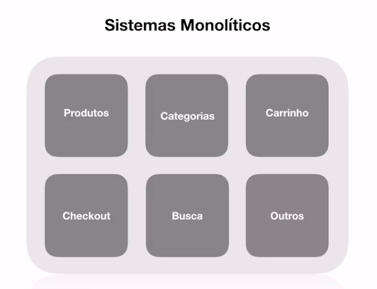

### Características de uma sistema monolítico

- Tudo esta dentro de um sistema, como regra de negócios, modelagens, entidades, etc;
- Alto acoplamento, ou seja, o sistema depende dele mesmo;
- Processo de deploy a cada mudança, ou seja, caso haja uma pequena alteração será necessário realizar o deploy de tod a aplicação;
- Pelo fato de ser um sistema único, raramente existem várias tecnologias utilizadas (se o sistema é feito em Java, raramente vai ter algo ecrito em PHP);

### Porém sistema monolítico não deve ser totalmente descartado

- Não é crime algum utilizar sistemas monolíticos;
- Na maioria dos casos vai atender;
- Menos complexidade na maioria dos casos.

### Escalando software

Geralmente temos duas formas de escalar um software:

#### 1. Escala vertical

Seria a escala que gradualmente agrega-se recursos computacionais (memória, HD, processamento, etc.), é a forma mais tradicional de escalar uma aplicação.

#### 2. Escala horizontal

Este tipo de escalonamento se dá não na agregação de recursos computacionais, mas sim na criação de novas máquinas virtuais dentro de um servidor. Entra em cena um recurso chamado **load balancer**, que vai distribuir as cargas dentre as máquinas criadas.

Geralmente é a forma de trabalho de escalonamento na AWS, GCP, Azure, etc.

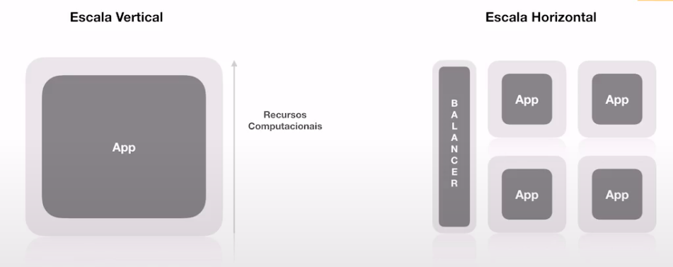

Existe uma diferença muito grande neste formato de escala - horizontal - que está ligada diretamente com o processo de arquitetura de software.

### Detalhes de uma arquitetura da aplicação

Para escalarmos de forma vertical ou horizontal temos que levar em consideração as seguintes situações:

- **Discos efêmeros**, onde as informações armazenadas serão temporárias que, quendo a máquina ée destruída, não teremos mais acesso às tais informações;
- **Servidor de aplicação vs Servidor de assets**, sabe quando o usuário vai fazer um upload no seu servidor e você guarda lá na pasta *uploads* que nem o Wordpress faz? Isso não existe mais! Tem que ter uma separação de quais arquivos são da aplicação e das que são **assets** (que são os arquivos estáticos). Imagina que estamos numa imagem em uma máquina e tudo está acontecendo ali sem problemas, agora, quando temos várias máquinas pequenas o que acontece? Nós fazemos o upload de um arquivo e este upload fica disponível numa única máquina. Se o usuário entra no load balance e acaba acessando outra máquina, não encontrará tais arquivos que demos o upload. Então temos que levar isso em conta numa arquitetura.
- **Cache centralizado**, imagine que a nossa aplicação possui recurso de cache servido através do Redis, numa abordagem vertical o Redis está disponível dentro da própria máquina, já na abordagem horizontal o Reds deverá ter a sua própri instância ou máquina de cache para que todos que acessarem, independente de qual máquina consiga soncumir as informações do cache. Pois um cache por máquina não seria a forma correta de se fazer.
- **Sessões centralizadas**, quando o usuário cria uma sessão em uma máquina, e logo após acaba sendo redirecionado pelo load balancer para outra instância de máquina, a mesma sessão deve estar disponível de forma distribuída.
- **Upload & Gravação de arquivos**, já abordade no item *Servidor de aplicação vs Servidor de assets*;

Agora, o mais importante das considerações, levando em conta todos os itens anteriores é que **TUDO PODE TER QUE SER DESTRUÍDO E CRIADO FACILMENTE**.

## Distribuição de Responsabilidades

Vimos anteriormente a complexidade e desafios em escalar um software de forma horizontal.

Portanto, temos que desenvolver o software dividindo as responsabilidades.

Supomos que temos a nossa aplicação, **numa abordagem vertical**, e pensando de uma forma mais distribuída, ou seja, fora da aplicação, temos um proxy reverso - como um NGINX em que toda a parte web ou servidor web cai nele e ele delega e faz a comunicação com a aplicação -, temos o Elastic pra consulta como se fosse um banco de dados, temos os assets - arquivos estáticos não ficam dentro da aplicação (imagens, uploads, etc) -, temos também o cache e o banco de dados. Esta distribuição ficaria da seguinte forma:

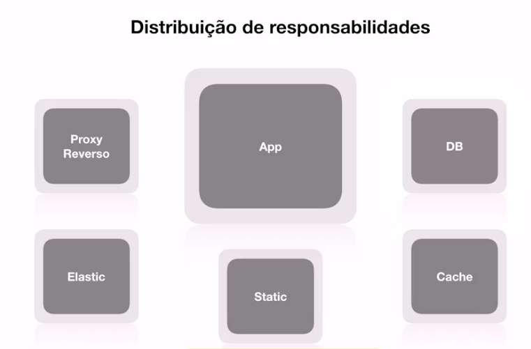

Esta distribuição é muito vantajosa, pois quando houver a necessidade de destruirmos a aplicação e dar o rebuild, nenhuma configuração do proxy, nenhum dado do Elastis ou banco de dados, etc. serão destruídos.

> Dica: Para banco de dados utilize de preferência o serviço de RDS da AWS, sem se preocupar com processos de escalar, redundância, backups, etc.

Agora vamos à seguinte distribuição com uma **abordagem horizontal**, onde teremos várias instâncias da mesma aplicação que vão consumir os mesmos recursos:

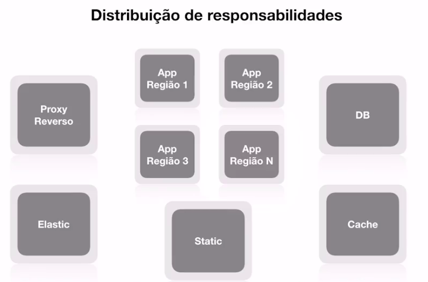

❗ 👆 Mas, ainda assim, trata-se de uma aplicação MONOLÍTICA 👆❗

Ou seja, normalmente as pessoas pensam que arquitetando o ecossistema de uma aplicação desta forma distribuída estão elaborando microsserviços.

Portanto aqui mostramos que existe a abordagem de estar trabalhando em um monolito em uma escala vertical com serviços totalmente distribuídos, descartando a ideia de que a arquitetura monolítica está em desuso.

### Quando aplicações monolíticas podem parar de valer a pena?

- Times grandes;
- Necessidade de escalar todo o sistema pelo fato de uma área em específico esteja com pico de utilização;
- Risco de um deploy completo começa a se elevar, pois quanto maior a aplicação mais crítica ela se torna. Fica aquele medo: se eu fizer um redeploy de minha aplicação, só por causa de uma pequena alteração de uma área, quem sabe, quase não tão utilizada, e cair tudo? 😨
- Necessidade de utilizar tecnologias diferentes.

# Microserviços

## O que é um serviço?

- Disponibiliza informação
- Realiza transações
- Resolve problemas de negócio
- Independente de tecnologia ou produto
- Pode estabelecer comunicação entre diversos "clientes" (sistemas, pessoas, ou qualquer coisa que se conecta neste serviço)

## SOA - Arquitetura Orientada a Serviços

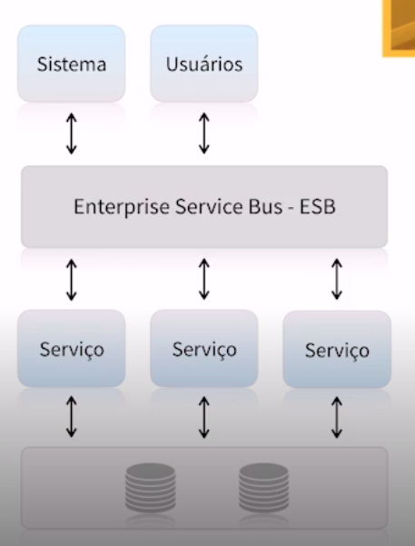

Em SOA:

- Serviços normalmente maiores baseados em funcionalidades;
- Necessidade de ESB (acima temos um esquema que representam vários sistemas e usuários que se conectam no **Enterprise Service Bus - ESB**, que por sua vez fará todo o roteamento dos serviços adequados para cada solicitação);
- SOA é conhecido como **Single Point of Failure**, ou seja, podemos ter vaŕios serviços, e se o ESB todos os sistemas caem. Portanto, todos dependem do ESB;
- Compartilhamento de banco de dados é comum;
- Muitas vezes também podem ter sistemas monolíticos sendo utilizados como serviços.

## Arquitetura baseada em microsserviços

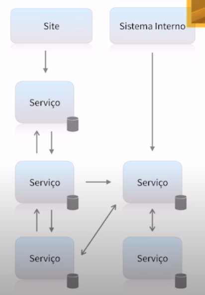

Podemos ver que não existe um poder centralizados (diferente da arquitetura tipo SOA que possui o ESB como pivô de toda a aplicação). Os serviços eles se comunicam e consomem entre si. Algumas peculiaridades podem ser destacadas, como cada serviço possui um banco de dados. Veja mais algumas características:

- Serviços pequenos com poucas responsabilidades;
- Maior tolerância a falhas, como nos microsserviços trabalham de forma descentralizadas, se um microsserviço cair não significará que todo o sistema ficará fora do ar, somente funcionalidades que pertencem a este microsserviço;
- Totalmente independente, ou seja, um microsserviço consegue resolver os seus próprios problemas, pois possui seu próprio banco de dados, infraestrutura, deploy, etc.;
- Comunicação síncrona ou assíncrona. 
    - Muitos microsserviços precisam em tempo real conseguir retirar ou processar uma informação em outro serviço. Quando isso acontece em tempo real, ou seja, eu preciso mandar uma requisição e receber uma resposta imediatamente, agente fala que esse tipo de comunicação é **síncrona**. 
    - Agora agente tem alguns pontos na parte de comunicação entre microsserviços que chamamos de comunicação **assíncrona**, onde muitas vezes mandamos uma informação para ser processada, e essa transação ficará em _background_ processando dentro do microsserviço por algum tempo e, quando tiver concluído, ele notificará o outro microsserviço.

## Microsserviços não são para todas as situações

Os microsserviços devem ser utilizados de forma responsável para que não haja um compromentimento negativo aos nossos trabalhos.

Temos que levar em consideração de algumas premissas ao utilizarmos os microsserviços:

- Arquitetura complexa, afinal, não teremos mais apenas um sistema para administrar, mas sim teremos vários e com estruturas próprias;
- Custo mais elevado com infraestrutura;
- Necessidade de mais equipes para manter;
- Sistema precisa ser grande suficiente para justificar;
- Gera problema que normalmente você não tinha antes;
- Monitoramento complexo.

> ❗❗❗❗❗❗❗❗❗❗❗❗❗❗❗❗❗❗❗❗❗❗❗❗❗
> **Microsserviço não é moda, mas sim necessidade!**
> ❗❗❗❗❗❗❗❗❗❗❗❗❗❗❗❗❗❗❗❗❗❗❗❗❗

## Orientação a Negócios

Agora vamos pegar todos os conceitos sobre microsserviços e separarmos em 9 características segundo **Martin Fowler**:

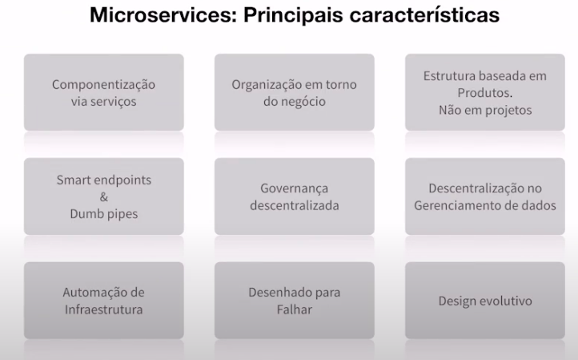

### Microsserviços - Componentização via serviços

- Services dos microsserviços não são as camadas de services da Orientação a Objetos;
- Componente é uma unidade de software independente que pode ser substituída e atualizada;

##### Desvantagens:

- Chamadas externas são mais custosas do que chamadas locais. Num sistema monolito a chamada para algum recurso se dá internamente de forma muito rápida - muitas vezes síncrona. Já microsserviços necessitam realizar seus processos consumindo ou servindo outros microsserviços que estarão em outra infraestrutura.
- Cruzamento entre componentes podem se tornar complexo;
- Transações entre serviços são "grandes desafios";
- Mudanças bruscas em regras de negócio podem afetar diversos serviços tornando o processo difícil de ser refeito

### Microsserviços - Organização em torno do negócio

- Um projeto é baseado em um ou mais produtos que trabalham em diferentes contextos, ou seja, temos que ver cada microsserviço como um produto pensando no negócio, e não na parte técnica;
- Time de desenvolvedores por produto;
- Muitas empresas tratam os times como *squads*;
- Cada *squad* é muitidisciplinar;
- Cada *squad* é responsável por um ou mais produtos (não muito recomendado ser muitos produtos);
- Cada produto pode ter um ou mais serviços envolvidos (e.g. sistema de *checkout* de uma loja virtual, que pode ter microsserviços responsáveis pelo gerenciamento de produtos, *shipping*, etc.);

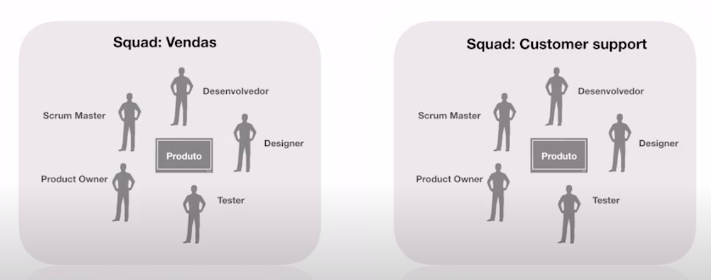

O esquema acima representa dois *squads* para cada área de negócio, mas não um sistema em si. Lembrando que um sistema é o resultado final de um produto que será entregue ao cliente, e às vezes este produto precisa de alguns sistemas juntos. MAS SEMPRE PENSANDO O LADO DO NEGÓCIO.

### Microsserviços - Smart endpoints & dumb pipes

- Exposição de APIs (ex.: REST, GraphQL);
- Comunicação entre serviços de forma síncrona ou assíncrona;
- Utilização de sistema de mensageria (ex: RabbitMQ). O sistema de mensageria não tem lógica, pois ele somente entrega e recebe as mensagens, nada mais;
- Garantia de que um serviço foi executado baseado na execução das filas. Quando um serviço cai, é muito importnate que ele retome de onde parou, portanto o uso de filas facilita bastante este processo;

### Microsserviços - Governança Descentralizada

A forma que iremos gerenciar toda estea estrutura, desde a documentação, softwares, banco de dados, SLA é totalmente descentralizado, ou seja, cada serviço tem as suas próprias regras.

- Ferramenta certa para o trabalho certo. Tecnologias podem ser definidas baseadas na necessidade do produto;
- Cada sreviço pode ter a sua própria metodologia e padrões de desenvolvimento em suas squads, levando em consideração em aplicar a tecnologia certa no lugar certo, e não ficar utilizando variadas tecnologias em variados projetos sem necessidade;
- Contratos de interface de forma independente, ou seja, o serviço e meu e eu defino como será a comunicação para com ele.

### Microsserviços - Automação de Infraestrutura

Para agregar qualidade, temos que disponibilizar de forma rápida novas versões do aplicativo, testes, deploys, etc. Se tivermos muitos microsserviços e não conseguirmos jogar para produção rapidamente será um grande problema.

- Utilização de Cloud computing;
- Testes automatizados;
- Continuous delivery;
- Continuous integration;
- Load Balancer / Autoscaling, pois temos que garantir que não haja intermitências ou lentidão na aplicação em eventuais picos de uso ou sobrecarga.

### Microsserviços - Desenhado para Falhar

Se um serviço sair fora do ar, o que deverá acontecer com àqueles que dependem dele? Temos então que desenhar um plano de *fallback* para degradar a funcionalidade faltante. Exemplo: usuário preenche campo de CEP para autocompletagem dos campos de endereço - logradouro, cidade, UF -, porém o serviço dos Correios está fora do ar. Para DEGRADAR A FUNCIONALIDADE não é interessante retornar um erro para o usuário, mas sim deixar o usuário preencher manualmente os campos, ou seja, criando um plano B.

- Tolerância a falhas;
- Serviços que se comunicam precisam de *fallback*;
- Logging;
- Monitoramento em tempo real (pior coisa é o cliente descobrir que a aplicação dele caiu ANTES de você);
- Alarmes;

### Microsserviços - Design Evolutivo

- Produtos bem definidos podem evoluir ou serem extintos por razões de negócio, ou seja, a área de negócios não podem atrapalhar a área técnica e vice-versa;
- Gerenciamento de versões (o lançamento de uma nova versão não podem "quebrar" o fluxo de serviços que estão usando a versão antiga);
- Replacement and Upgradeability, ou seja, substituição rápida de um serviço por outro ou fazer rapidamente o upgrade de um serviço, sem comprometer quem estiver utilizando naquele exato momento.
