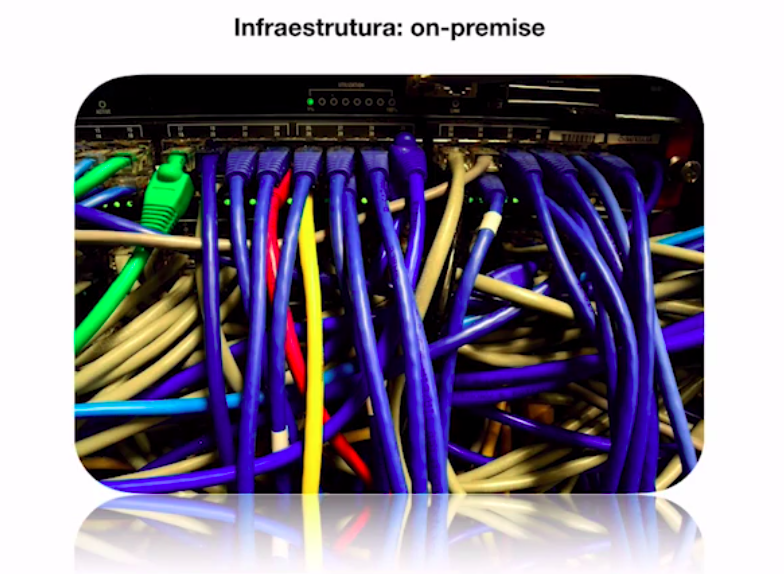

# Arquitetura de Software - Fundamentos

## O que é arquitetura? - Pilares

### 1. Organização de um sistema

Organização não somente o software em si, mas todo o processo que envolve o software. 

### 2. Componentização

Junção dos componentes que conseguimos fazer um sistema completo - ecossistema. Um componente pode ser reutilizado em diversos sistemas ou processos, evitando retrabalho.

### 3. Relacionamento entre sistemas

Os softwares hoje em dia reodam de forma integrada, e o arquiteto de software entende como os componentes de software se relacionarão entre si, gerando uma cadeia de fluxo de informações.

### 4. Governança

Forma de como vamos documentar todo o processo de arquitetura, forma de como definir os times, forma de como definiremos os bancos de dados, integrações, etc.

### 5. Ambiente

Tratamento de ambientes de produção, testes, desenvolvimento, etc. provendo a definição da padronização destes ambientes antes mesmo de começarmos a desenvolver.

### 6. Projeto

Algo que tem um início, meio e fim. 

### 7. Projeção

Não deve-se pensar no software como ele está neste momento, mas quais as possibilidades que este software vai poder começar a atender o futuro.

### 8. Cultura

O arquiteto de software vai estudar quais são as melhores tecnologias para serem implementadas mediante o desafio de que cada desenvolvedor envolvido vem de um canto e possui uma forma de desenvolver, conhecendo as mais diversas tecnologias.

## Frameworks

Frameworks são ferramentas e métodos que nos ajudam a focar essencialmente no objetivo final. Frameworks nos ajudam a definir um padrão de trabalho.

Quando falamos de arquitetura de software, teremos duas entidades bem importantes:

### TOGAF

É um framework conceitual, ou seja, que todo engenheiro e arquiteto de software deveriam ter pelo menos uma destas competências ou definições.

Define os processos de arquitetura. A documentação possui mais que 900 páginas. Mas é importante saber pelo menos o essencial.

A TOGAF setam conceitos e nomenclaturas padronizadas.

Visão geral de tipos de arquiteturas - TOGAF não se limita somente em arquitetura de software:

- negócio;
- sistema de informação;
- tecnologia;
- planos de migração

### ISO / IEC / IEEE 42010 - Systems and software engineering - Architecture description

Lançado em 2011, é bem mais simplificado que o TOGAF, formalizando os fundamentos da área de arquitetura de software.

## Momentos da Arquitetura de Software

### Momento: Tradicional

### Momento: Atual

### Momento: Emergente

### Momento: Futuro

Não haverá mais necessidade em trabalhar com aqueles processos inteiros de operação para conseguirmos subir as aplicações, não ficar preocupados com servidores, memória, versões, backups. Ou seja, todo o processo de DevOps sairão das nossas mãos e ficarão sendo administradas pelas própias nuvens.

## Introdução e Escalabilidade e Sistemas Monolíticos

### Características de uma sistema monolítico

- Tudo esta dentro de um sistema, como regra de negócios, modelagens, entidades, etc;
- Alto acoplamento, ou seja, o sistema depende dele mesmo;
- Processo de deploy a cada mudança, ou seja, caso haja uma pequena alteração será necessário realizar o deploy de tod a aplicação;
- Pelo fato de ser um sistema único, raramente existem várias tecnologias utilizadas (se o sistema é feito em Java, raramente vai ter algo ecrito em PHP);

### Porém sistema monolítico não deve ser totalmente descartado

- Não é crime algum utilizar sistemas monolíticos;
- Na maioria dos casos vai atender;
- Menos complexidade na maioria dos casos.

### Escalando software

Geralmente temos duas formas de escalar um software:

#### 1. Escala vertical

Seria a escala que gradualmente agrega-se recursos computacionais (memória, HD, processamento, etc.), é a forma mais tradicional de escalar uma aplicação.

#### 2. Escala horizontal

Este tipo de escalonamento se dá não na agregação de recursos computacionais, mas sim na criação de novas máquinas virtuais dentro de um servidor. Entra em cena um recurso chamado **load balancer**, que vai distribuir as cargas dentre as máquinas criadas.

Geralmente é a forma de trabalho de escalonamento na AWS, GCP, Azure, etc.

Existe uma diferença muito grande neste formato de escala - horizontal - que está ligada diretamente com o processo de arquitetura de software.

### Detalhes de uma arquitetura da aplicação

Para escalarmos de forma vertical ou horizontal temos que levar em consideração as seguintes situações:

- **Discos efêmeros**, onde as informações armazenadas serão temporárias que, quendo a máquina ée destruída, não teremos mais acesso às tais informações;
- **Servidor de aplicação vs Servidor de assets**, sabe quando o usuário vai fazer um upload no seu servidor e você guarda lá na pasta *uploads* que nem o Wordpress faz? Isso não existe mais! Tem que ter uma separação de quais arquivos são da aplicação e das que são **assets** (que são os arquivos estáticos). Imagina que estamos numa imagem em uma máquina e tudo está acontecendo ali sem problemas, agora, quando temos várias máquinas pequenas o que acontece? Nós fazemos o upload de um arquivo e este upload fica disponível numa única máquina. Se o usuário entra no load balance e acaba acessando outra máquina, não encontrará tais arquivos que demos o upload. Então temos que levar isso em conta numa arquitetura.
- **Cache centralizado**, imagine que a nossa aplicação possui recurso de cache servido através do Redis, numa abordagem vertical o Redis está disponível dentro da própria máquina, já na abordagem horizontal o Reds deverá ter a sua própri instância ou máquina de cache para que todos que acessarem, independente de qual máquina consiga soncumir as informações do cache. Pois um cache por máquina não seria a forma correta de se fazer.
- **Sessões centralizadas**, quando o usuário cria uma sessão em uma máquina, e logo após acaba sendo redirecionado pelo load balancer para outra instância de máquina, a mesma sessão deve estar disponível de forma distribuída.
- **Upload & Gravação de arquivos**, já abordade no item *Servidor de aplicação vs Servidor de assets*;

Agora, o mais importante das considerações, levando em conta todos os itens anteriores é que **TUDO PODE TER QUE SER DESTRUÍDO E CRIADO FACILMENTE**.